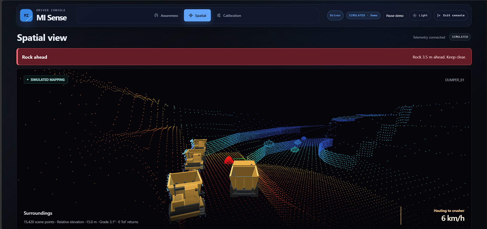
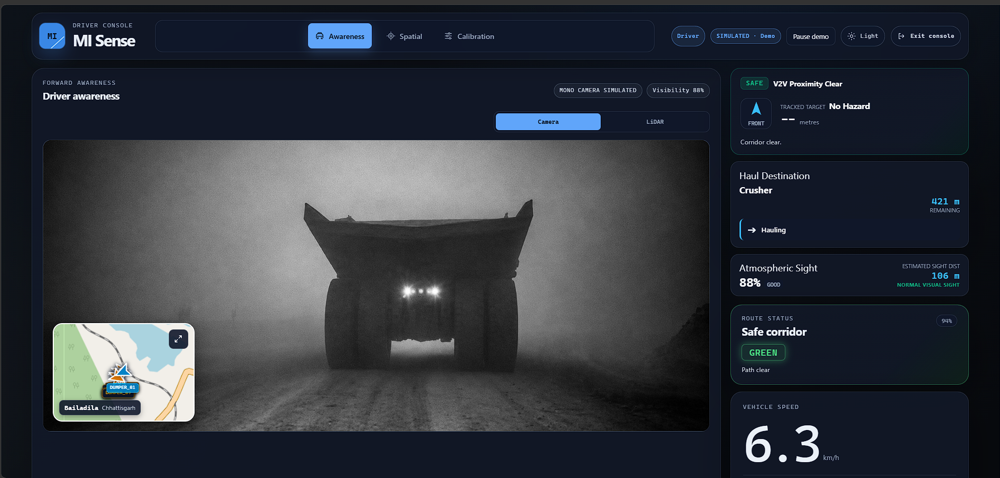
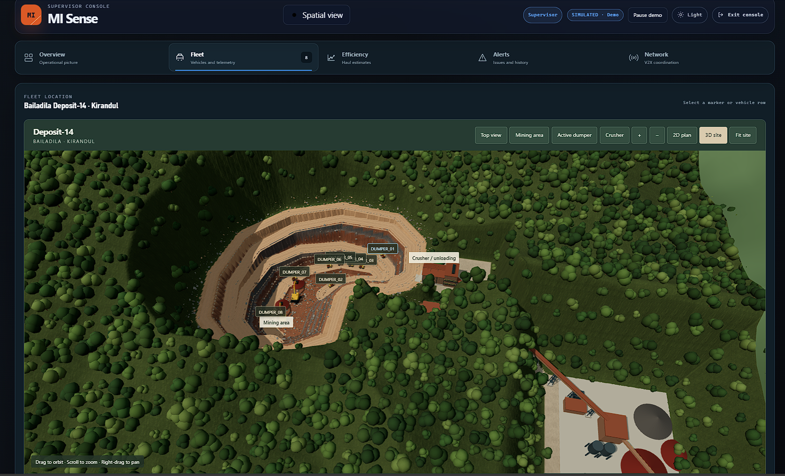
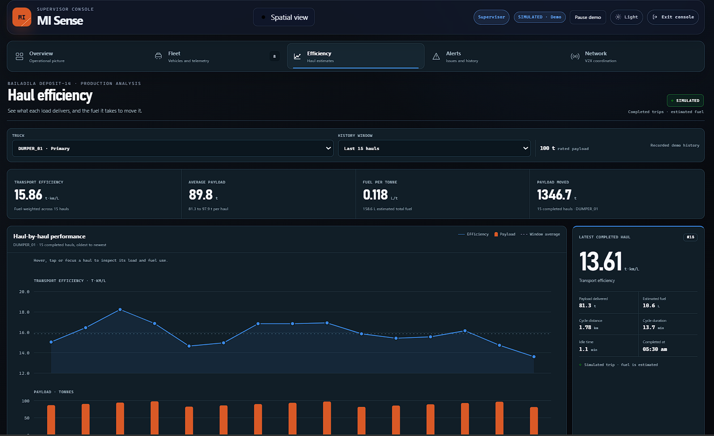

# MI Sense

MI Sense is purpose-built for mine haulage in fog and low visibility. In a local
LIVE setup, truck telemetry feeds one world model for both consoles. The driver
screen keeps nearby hazards and corridor status prominent; the supervisor
screen separates fleet status, alerts and haul analysis.

## Website views

Screenshots are from the SIMULATED demo.

### Spatial surroundings



The spatial view shows point-mapped surroundings and a rock-ahead warning above the truck scene.

### Driver awareness



The driver sees the forward camera view, route, visibility, corridor status and speed on one screen.

### Supervisor fleet



The supervisor map locates dumpers between the mining area and crusher in an illustrative 3D scene.

### Haul efficiency



The per-haul chart compares transport efficiency and payload. A side panel shows estimated fuel and the latest completed trip.

## Live system

- The local LIVE runtime accepts telemetry from MAIN over USB or Wi-Fi. MAIN aggregates the FRONT and MIDDLE sensor nodes.
- The backend owns the map, vehicle state, hazards and safety status. Both consoles read that state.
- The driver console prioritizes forward awareness and warnings. The supervisor console shows fleet and sensor status, alerts and available haul data.

The current physical profile leaves Hall sensors and the motor-cut relay disconnected. Prototype ToF sensing is not industrial LiDAR, BMP280 altitude is relative, and the motor-cut output is not production braking.

See [implementation status](docs/IMPLEMENTATION_STATUS.md),
[haul workflow and efficiency](docs/haul-simulation.md) and
[hardware setup](firmware/README.md) for details.

## Technology stack

| Layer | Software |
| --- | --- |
| Backend and world model | Python, FastAPI, Pydantic, NumPy, and Shapely |
| Dashboard and mine scene | React, TypeScript, Vite, and Three.js |
| Controller firmware | ESP32, Arduino framework, and PlatformIO |

The software named above is open-source. The Government of India's [Policy on Adoption of
Open Source Software](https://www.meity.gov.in/static/uploads/2024/02/policy_on_adoption_of_oss.pdf)
expresses a preference for open-source software in government e-governance
systems. It does not certify MI Sense or approve this particular stack.

## Requirements

- Python 3.11 or newer;
- Node.js 20 or newer;
- npm 10 or newer.

Docker Desktop is optional. When available, Docker Compose runs the backend and
production frontend without installing Python or Node dependencies on the host.
The DehazeFormer-MCT view uses Docker's NVIDIA runtime and an NVIDIA GPU. Raw
camera video continues if ML enhancement is disabled or unavailable.

Firmware work also requires Arduino CLI. `scripts/setup-firmware.ps1` installs
the pinned ESP32 core and libraries once Arduino CLI is on `PATH`.

The simulator, backend world model, schematic map, and safety logic need no
cloud service. Leaflet loads OpenStreetMap road tiles over the internet. Those
tiles are an optional display background and never feed localization or safety
decisions.

## Setup

From the repository root:

```powershell
python -m venv .venv
.\.venv\Scripts\python.exe -m pip install -e ".[dev]"
Set-Location frontend
npm ci
Set-Location ..
```

## Run

Start the backend from the repository root:

```powershell
.\.venv\Scripts\python.exe -m uvicorn backend.app.main:app --host 127.0.0.1 --port 8000
```

In another terminal:

```powershell
Set-Location frontend
npm run dev
```

Open `http://127.0.0.1:5173`.

For the connected ESP32 MAIN and Pi camera, use the LAN-aware launcher instead:

```powershell
.\scripts\start_live_fogsen.ps1
```

It resolves `misense.local`, finds MAIN's CP210x USB port, binds the API and
Wi-Fi listener to the laptop's LAN interfaces, selects `LIVE` + `BOTH`, and
connects the camera over TCP. Pass `-SerialPort COMx` if more than one CP210x
adapter is connected. Run
the check from another terminal:

```powershell
.\.venv\Scripts\python.exe scripts\check_live_network.py
```

The launcher leaves camera enhancement off for the first connectivity check.
Enable the optional ML worker only after the raw feed is stable.

For a sensor-only run while the Pi is offline:

```powershell
.\scripts\start_live_fogsen.ps1 -NoCamera -TelemetryHz 20
.\.venv\Scripts\python.exe scripts\check_live_network.py --skip-camera
```

## Run with Docker

From the repository root:

```powershell
docker compose up -d --build --wait
```

Open `http://127.0.0.1:8080`. The frontend container proxies `/api` and `/ws` to
the backend container. See [docs/DOCKER.md](docs/DOCKER.md) for health and log
commands.

Backend checks:

- `http://127.0.0.1:8000/api/health`
- `http://127.0.0.1:8000/api/status`
- `http://127.0.0.1:8000/api/world`
- `http://127.0.0.1:8000/api/camera/status`
- `http://127.0.0.1:8000/api/camera/frame?view=raw`
- `http://127.0.0.1:8000/api/camera/frame?view=enhanced`
- `http://127.0.0.1:8000/api/camera/frame?view=ir`
- `http://127.0.0.1:8000/api/v2x/state`
- `ws://127.0.0.1:8000/ws/telemetry`
- `http://127.0.0.1:8000/docs`

## Raspberry Pi camera over Wi-Fi

The Pi runs `camera/pi_sender/sender.py` through `fogsen-camera.service` and
listens on TCP port 8888. The default source is
`tcp://misense.local:8888`; override `FOGSEN_CAMERA_STREAM_URL` with the Pi's
current LAN IP when Docker cannot resolve mDNS. USB video and USB-LAN are not
used.

The laptop decodes one shared H.264 connection, calculates camera visibility,
and exposes raw and enhanced MJPEG views to every dashboard client. The ML
worker drops old work instead of queuing frames, so the raw feed stays current.
Camera data and enhanced imagery remain driver aids; neither can trigger a
motor cut without the range-sensor safety path.

When `FOGSEN_CAMERA_IR_ENABLED=true`, the backend can create an additional
false-color IR-style stream with OpenCV on the CPU or PyTorch on CUDA. It uses
brightness from the normal RGB frame and a configured color map. It does not
measure temperature, see through fog, or replace a thermal sensor. The endpoint
is `/api/camera/stream?view=ir`; configuration is documented in `.env.example`.

## Maps and simulated V2X

The backend `ReferenceMap` remains MI Sense's operational map. Its route starts
near `V699+X9, Chennai, Tamil Nadu` and follows mapped campus roads. The driver
gets a compact road map and an expanded route view. The supervisor can switch
between the backend schematic and the same road map. The frontend converts
local Cartesian coordinates around the configured site anchor only for
rendering. OpenStreetMap tiles are not localization or safety evidence.

`WorldState.v2x` contains the current software simulation of V2V and V2I. It
models peer vehicles, roadside units, basic safety messages, link estimates,
advisories, and a bounded packet log. `GET /api/v2x/state` reads that state.
`POST /api/v2x/messages/bsm` and `POST /api/v2x/broadcast-advisory` update the
in-memory simulation. MI Sense does not currently connect to a DSRC, C-V2X, or
other V2X radio.

## Wired firmware

Set up and compile all three controllers:

```powershell
.\scripts\setup-firmware.ps1
.\scripts\verify-firmware.ps1
```

After flashing MAIN, validate the USB fallback without starting the dashboard:

```powershell
.\.venv\Scripts\python.exe -m pip install pyserial
.\.venv\Scripts\python.exe -m backend.app.serial_monitor --port COM11 --send STATUS
```

Replace `COM11` with the port shown by `arduino-cli board list`. Full wiring,
power, upload, and bench-test instructions are in `firmware/README.md`.
The ignored `firmware/main_esp32/wifi_secrets.h` stores the private network
values and backend computer IPv4 address. Do not commit it.

To feed MAIN telemetry into the dashboard, install the hardware dependencies
and start the backend in explicit `LIVE` mode:

```powershell
.\.venv\Scripts\python.exe -m pip install -e ".[hardware]"
$env:FOGSEN_MODE = "LIVE"
$env:FOGSEN_TELEMETRY_TRANSPORT = "BOTH"
$env:FOGSEN_SERIAL_PORT = "COM11"
$env:FOGSEN_WIFI_LISTEN_HOST = "0.0.0.0"
$env:FOGSEN_WIFI_LISTEN_PORT = "8765"
.\.venv\Scripts\python.exe -m uvicorn backend.app.main:app --host 0.0.0.0 --port 8000
```

Start the frontend normally in another terminal. `SIMULATED` remains the
default when `FOGSEN_MODE` is not set. Replace `COM11` with MAIN's current port.
In `BOTH` mode, USB and Wi-Fi are read concurrently, identical frames are
accepted once, and either link can keep the dashboard live. If neither source
delivers fresh MAIN data, the runtime publishes five invalid ranges, degraded
health, a grey corridor, and a warning instead of leaving the last healthy
state on screen.

## Test

```powershell
.\.venv\Scripts\python.exe -m pytest
Set-Location frontend
npm test
npm run build
Set-Location ..
.\scripts\verify-firmware.ps1
```

## Coordinate convention

MI Sense uses metres and seconds internally. In the vehicle frame, positive X points right and positive Y points forward. The world frame is fixed local Cartesian. Heading is clockwise from world positive Y.

## Repository layout

```text
backend/     FastAPI, canonical world model, providers, simulation, and tests
camera/      Raspberry Pi Wi-Fi camera sender and systemd unit
config/      Vehicle, sensors, safety thresholds, and demo settings
docs/        Architecture, contracts, hardware, calibration, and demo notes
firmware/    BACK/MAIN, FRONT, and MIDDLE wired ESP32 firmware and build notes
frontend/    React app with independent layout, view-router, and domain views
maps/        Saved reference twins
recordings/  JSONL record and replay files
scripts/     Local launch and validation helpers
```

Read `PROJECT_CONTEXT.md` before changing the frozen V1 architecture. Contributors and coding agents must also follow `AGENTS.md`.

## License

The contributors license MI Sense's project-authored code and documentation under
the [MIT License](LICENSE). Third-party software and assets keep their own terms;
see [third-party components](docs/THIRD_PARTY.md),
[mine terrain materials](frontend/public/textures/mine/ATTRIBUTION.md), and
license notices included with dependencies.
